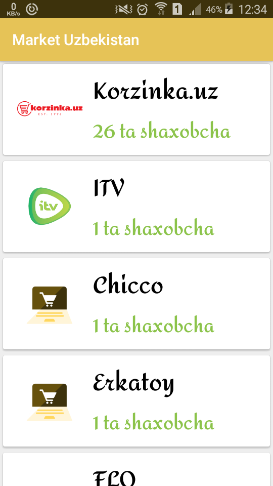
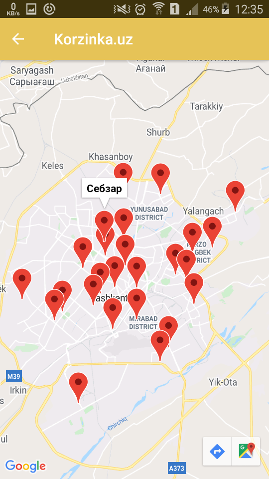

# TestMap_MarketUzbekistan
## Ishlatilgan texnalogiyalar
1. MVVM (arxitektera uchun)
2. Retrofit 2 / Gson (internetdan ma'lumot yuklash uchun)
3. Coroutines (oqimlar uchun)
4. Glide (rasm yuklash uchun)
5. Google Map

## Check out the [foydalanilgan api linki](https://androidapi.lebazar.uz/api/v1/company/list/)

## Dastur sxemasi

## Birinchi oyna/kompaniyalar ro'yxati

## Ikkinchi oyna/kompaniya shaxobchalari manzillari

### Bog'lanish uchun
[Telegram](https://t.me/abbos2101)
[Facebook](https://www.facebook.com/abbos.bobomurodov.2101)
